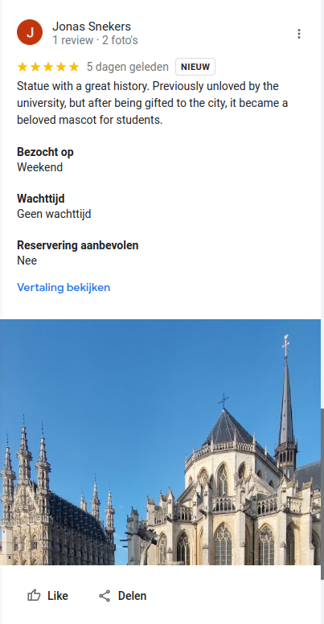

> I went on a city tour recently (10 October 2023, to be very precise), where they told a nice story about this guy. 
> At first nobody was really enthusiastic, but now everyone gives him rave reviews.
>
> Can you find out where the flag is located?
> 
> 

## Image recognition

Step 1 is recognizing the statue in the image. 
Anyone who's been around Leuven should have seen this little guy, called [Fonske](https://nl.wikipedia.org/wiki/Fonske), hanging around on the Rector De Somerplein. 
(For anyone interested, I can recommend [this article](https://www.nieuwsblad.be/cnt/blpla_20121018_001) to learn about his history, and how the university just gave him to the city because they didn't know what to do with him.)

Step 2 is finding out more about Fonske. 
What would be a website about where things are *located* and where people can give *reviews*?

Right, Google Maps! 
Let's look for [Fonske's pin on Google Maps](https://maps.app.goo.gl/H6T7Z4aMGrg9Xs8d6), and browse through the recent reviews (sorting on 'Newest' will be useful). 
Alternatively, you can also look at the recent photos. 

> Note: the challenge was originally uploaded the day before the CTF101 event, and the description read that "I went on a city tour yesterday", as a hint to look for reviews from the day before. Nowadays, you will probably have to scroll a bit to find the review posted on 10 October 2023.

Apparently, Jonas Snekers (fake Google accounts always come in handy 👀) went on a tour recently, and gave a five-star review to Fonske. 
He also left an interesting photo...

That looks like the same photo as in the challenge description, but now there is... a QR code! 
Let's scan it and see where it leads us: [https://www.youtube.com/watch?v=Kq5RV14D6qE](https://www.youtube.com/watch?v=Kq5RV14D6qE)

## Video transcription
The video is hosted by "Vector Stellar" (so we know we're on the right track), and while it is super interesting and has a very nice soundtrack, the flag is nowhere to be seen yet.
But, like any good YouTuber, we are requested in the description to "check out my other videos". 
So let's visit [Vector's channel](https://www.youtube.com/@VectorStellar), where we find a "numbers" video: [https://www.youtube.com/watch?v=HYrUWx-N-Xc](https://www.youtube.com/watch?v=HYrUWx-N-Xc)

This video shows a grid (/chart) of 0-F rows and 0-F columns, with the Stellar Vector moving around, suspiciously always on the intersection of two lines. 
Two hex characters, what could that be...

After a lot of fun reading the characters off this grid -- remember, the x-axis is at the bottom, the y-axis to the left, so we read the bottom character first! --, we get this sequence:

`73 76 7b 66 30 6e 35 5f 73 61 70 4f 53 49 4e 54 69 61 65 7d`

Those in the know will recognize that these are hex representations of [ASCII codes](https://en.wikipedia.org/wiki/ASCII), which you can decode into letters.
[CyberChef](https://gchq.github.io/CyberChef/) is always a great tool for dealing with such encodings, and even if you did not know yet about ASCII and hex, you can still use its "magic wand" button (next to "Output") to automatically detect the most likely encoding. 
One way or another, you should end up with a simple recipe: "From Hex (Delimiter: Space)", which when given the sequence above, produces this string:

`sv{f0n5_sapOSINTiae}`

which looks like it is the flag! Challenge completed 👊
